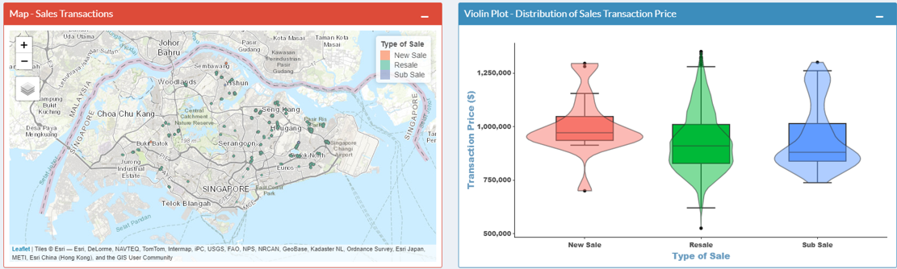
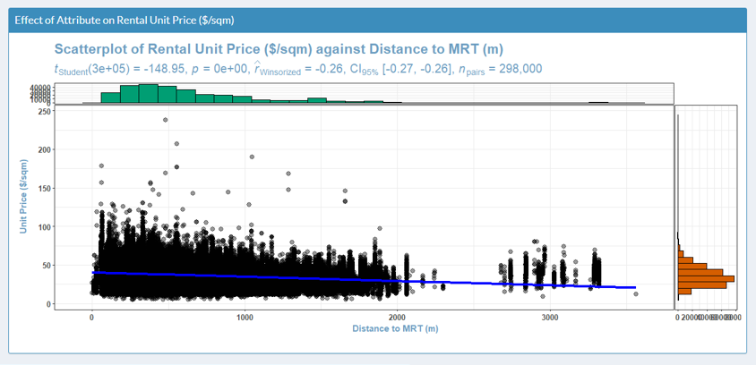
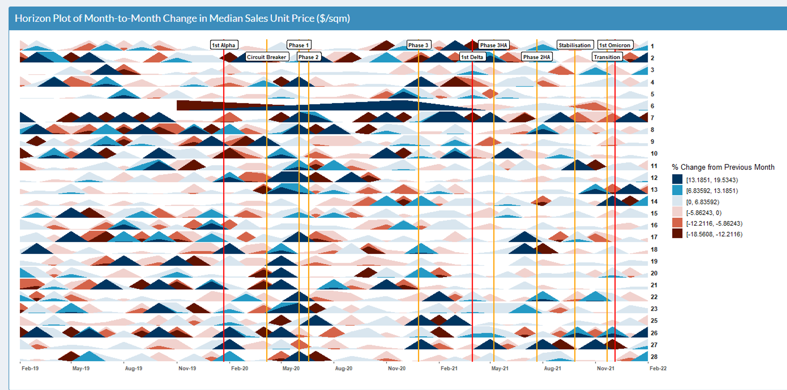
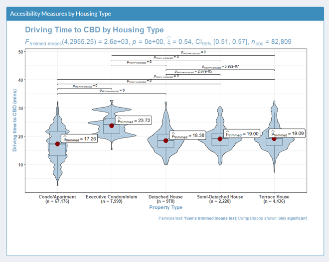

```{r setup, include=FALSE}
knitr::opts_chunk$set(echo = FALSE)
```

# Introduction

Many Singaporeans dream of earning passive rental income from renting out a second residential property. However, it can be quite daunting for first-time investors to choose a property to invest in because of the large capital outlay and market complexity. Our Shiny App helps users to:

1. Make unbiased sales/rental price comparisons of their candidate property to other properties of similar characteristics;
2. Better understanding how the physical characteristics (e.g. location) affect sales and rental prices to aid in choosing candidate properties.

# Data Sources and Preparation

The app makes uses of sales and rental property data from January 2019 to February 2022 downloaded from the [REALIS](https://www.ura.gov.sg/reis/index), the official source of private property transaction data.. The study period was chosen to include some pre-COVID transactions to show the impact of the pandemic. The datasets contain variables on transaction details (price), address and its physical characteristics (e.g. size, tenure).

Addresses were geocoded using the [OneMap API](https://www.onemap.gov.sg/docs/) to find 2 accessibility measures: distance to neart MRT station and driving travel time to the CBD. ArcGIS was used to compute the straight line distance of each property to the nearest [MRT station](https://data.gov.sg/dataset/master-plan-2019-rail-station-layer). Travel time to CBD was aggregated by 400mx400m grids. For each grid, the driving time from the centroid to the CBD (Raffles Place MRT station) was obtained from the [Google Distance Matrix API](https://developers.google.com/maps/documentation/distance-matrix/overview).

# App Concept

## Tool 1: Overview

```{r overview, out.width='80%', fig.align='center', fig.cap='Overview tab', fig.height=5}

```

First, users can study price distribution of past transactions in the "Overview" tab based on desired property characteristics in the reactive map and violin plot (Fig \@ref(fig:overview)). The map will show the geographic locations and property names, and violin plot shows distribution of price.

## Tool 2: Price Sensitivity

Next, users can use the "Price Sensitivity" tab (Fig \@ref(fig:pricesense))) to generate insights on how the unit price varies across different property characteristics. Users can choose different types of statistical tests to perform to check if the effect of each attribute on price is statistically significant.

```{r pricesense, out.width='80%', fig.align='center', fig.cap='Overview tab', fig.height=5}

```

## Tool 3: Time Trend

After drawing insights on the effect of physical factors on price, this seris of tab allows the user to explore trends over time through time series visualisations. Significant COVID-19 events/regulations to show how the property market reacted. Users can zoom in one specific property types or postal districts.

```{r time, out.width='80%', fig.align='center', fig.cap='Overview tab', fig.height=5}

```

## Tool 4: Mythbusting

Lastly, users can explore some interesting questions about residential properties in Singapore to deepen their understanding of residential properties in Singapore and clarify their pre-conceptions. 3 themes are explored:
- Are older houses bigger?
- Are some housing types more accessible?
- Does launch phasing matter when buying new condominiums?

```{r myth, out.width='80%', fig.align='center', fig.cap='Overview tab', fig.height=5}

```

After going through all the tabs, users should be armed with a better understanding of housing trends, price trends and how different physical attributes affect price. They can then return to the overview page to identify and evaluate candidate properties for investment.

## Insights

# Future Work


