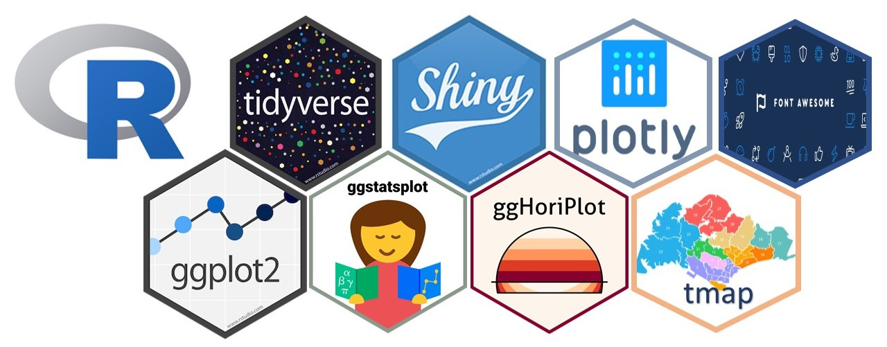
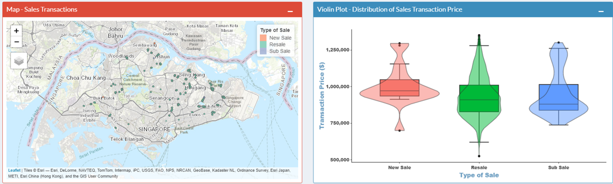

```{css, echo=FALSE}
.title_container{
  height: 2.65in;
}

.poster_body p{
  margin-top: 0mm;
}


code {
    font-size: 28pt;
    padding: 0.5mm;
    border-radius: 2mm;
}

img {
  margin-top:0cm;
}

```

```{r setup, include=FALSE}
knitr::opts_chunk$set(echo = FALSE)
```
# Introduction & Objectives 
Many Singaporeans dream of earning passive rental income from renting out a second residential property. Many commercial property websites provide some data on the property market, but only show simple summary statistics that do not tell the full story. Our Shiny app aims to address this shortcoming and help users to:

1. Make unbiased sales/rental price comparisons of their candidate property to other properties of similar characteristics;
2. Better understand how the physical characteristics affect sales and rental prices to aid in choosing candidate properties.

# Data Preparation 
The app makes uses of sales and rental property data from January 2019 to February 2022 downloaded from [REALIS](https://www.ura.gov.sg/reis/index). The study period includes some pre-COVID transactions to show the impact of the pandemic. The datasets contain transaction details, address and physical characteristics. The data was cleaned to normalise bulk transactions and some fields (e.g. size, tenure) were binned by natural breaks.

We included location by geocoding addresses and incorporating 2 accessibility measures: straight line distance to nearest MRT station and driving time to the CBD. Travel time to CBD (from [Google Distance Matrix API](https://developers.google.com/maps/documentation/distance-matrix/overview)) was aggregated to the centroids of 400mx400m grids.

# Methodology 
The app uses visual analytics techniques to help viewers to conduct exploratory data analysis. `tidyverse` packages, `ggstatsplot`, `ggHoriPlot`, `sf`, `mapview`, `tmap` were used.

```{r packages, out.width='60%', fig.align='center'}

```


# App Concept 
The first 3 tools are available for both sales and rent.

**Tool 1: Overview**: First, users can study price distribution in the "Overview" tab based on desired property characteristics in the reactive map and violin plot. The map will show the locations and property names, and violin plot shows price distribution.

```{r overview, out.width='75%', fig.align='center', fig.height=3}

```

**Tool 2: Price Sensitivity**: Users can generate insights on how the unit price varies across different property characteristics in this tab. Users can choose different types of statistical tests to check if the effect of each attribute on price is statistically significant.

```{r pricesense, out.width='70%', fig.align='center', fig.height=3}
knitr::include_graphics('images/Picture2.png')
```

**Tool 3: Time Trend**: Next, this series of tabs allows the user to explore trends over time. Significant COVID-19 events are overlaid to show how the property market reacted. Users can zoom in on a specific property type or postal district.

```{r time, out.width='75%', fig.align='center', fig.height=3}
knitr::include_graphics('images/Picture3.png')
```

**Tool 4: Mythbusting**: Lastly, users can explore some interesting questions about residential properties to deepen their understanding and clarify their pre-conceptions. 3 themes are explored:

- Are older houses bigger?
- Are some housing types more accessible?
- Does pricing of new project launch changes overtime?

After going through all the tabs, users should be armed with a better understanding of the housing market. They can return to the overview page to identify and evaluate candidate properties for investment.

# Insights
From sales transactions over the last 3 years, we observe that:

1. Average size of houses showed a clear decreasing trend over time, except for some types of landed housing. 
2. On average, non-landed housing types are nearer to an MRT station than landed housing types.
3. Executive condominiums were the furthest from the CBD, followed by landed housing types. 
4. Different developers have different strategies for pricing their launch phases and the earliest launch is not always the lowest priced.
5. Median sales unit price increased in most districts at the during the first few months of the Circuit Breaker (up to 19%). However, median rental unit price was not as volatile with smaller monthly changes (-3.6% to 4.4%) over the last 3 years.

# Future Work 
Our app helps in choosing a golden goose. Future work should help viewers decide when to buy.

1. **Break-Even Analysis**: To estimate time taken to break-even on an investment, considering components such as trend in mortgage rate, taxes, total debt servicing ratio etc.
2. **Predictive Analysis**: To create predictive models on expected price range for properties with selected characteristics, using `tidymodels` packages.

